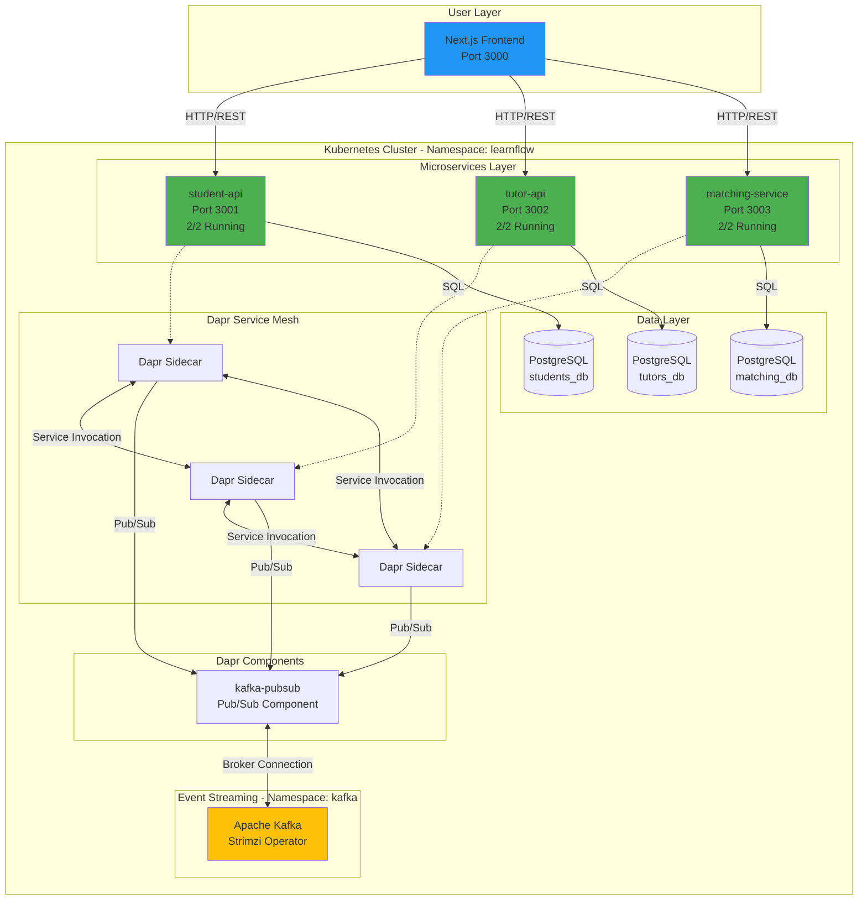
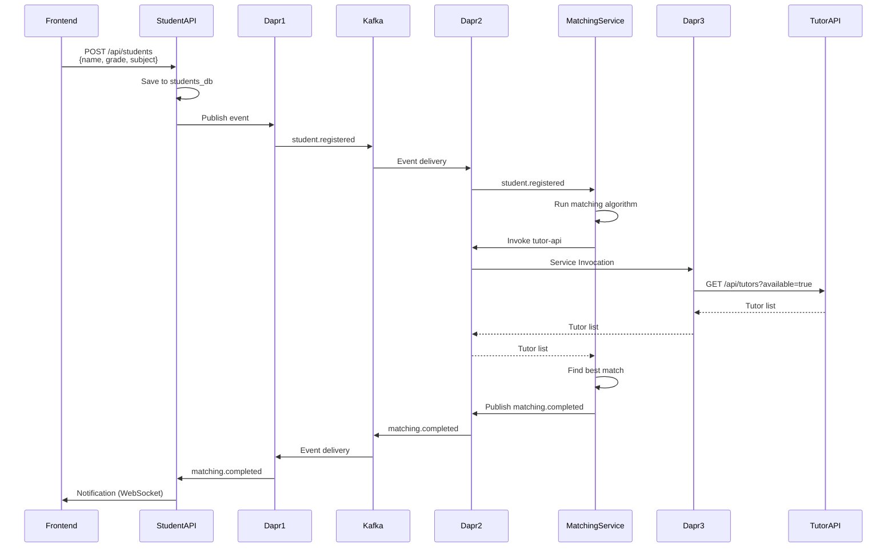
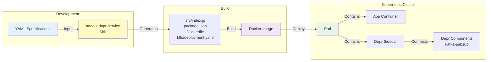
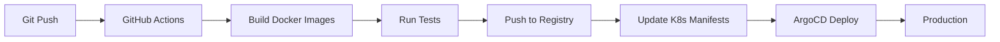

# LearnFlow - System Architecture

**Event-Driven Microservices on Kubernetes with Dapr**

---

## 🏗️ High-Level Architecture



---

## 📊 Component Details

### Microservices

| Service | Port | Database | Events Published | Events Consumed |
|---------|------|----------|------------------|-----------------|
| **student-api** | 3001 | students_db | student.registered<br/>student.updated | tutor.matched |
| **tutor-api** | 3002 | tutors_db | tutor.registered<br/>tutor.availability.changed | student.matched |
| **matching-service** | 3003 | matching_db | matching.completed | student.registered<br/>tutor.registered |

### Infrastructure

| Component | Technology | Status | Purpose |
|-----------|-----------|--------|---------|
| **Orchestration** | Kubernetes (Minikube) | ✅ Running | Container management |
| **Service Mesh** | Dapr 1.16.5 | ✅ 8/8 pods | Pub/Sub, Service Invocation |
| **Databases** | PostgreSQL (Bitnami) | ✅ 3/3 pods | Persistent storage |
| **Event Streaming** | Kafka (Strimzi 0.49.1) | ⏸️ Pending | Event backbone |

---

## 🔄 Event Flow Diagram



---

## 🛠️ Technology Stack

### Application Layer
- **Runtime**: Node.js 20 (Alpine)
- **Framework**: Express.js
- **Language**: JavaScript

### Service Mesh
- **Dapr**: 1.16.5
  - Sidecar injection via annotations
  - HTTP API (Port 3500)
  - gRPC API (Port 50001)
  - Metrics (Port 9090)

### Data Layer
- **PostgreSQL**: 16.x (Bitnami Helm Chart)
  - Ephemeral storage (development)
  - Default credentials
  - Per-service database isolation

### Event Streaming
- **Kafka**: 3.9.0
  - Strimzi Operator: 0.49.1
  - KRaft mode (no Zookeeper)
  - Internal listeners (plain + TLS)

### Orchestration
- **Kubernetes**: 1.34 (Minikube)
- **Namespace**: learnflow (services), kafka (event streaming)
- **Image Registry**: Minikube Docker daemon

---

## 📦 Deployment Architecture



---

## 🔒 Security Architecture

### Network Policies
- Services isolated in learnflow namespace
- Kafka isolated in kafka namespace
- Cross-namespace communication via Dapr

### Service Authentication
- Dapr mTLS between sidecars
- Service-to-service via Dapr API (not direct)

### Database Security
- PostgreSQL credentials via Kubernetes Secrets
- Per-service database isolation
- Connection pooling via Dapr state store

---

## 📈 Scalability Design

### Horizontal Pod Autoscaling (HPA)
```yaml
apiVersion: autoscaling/v2
kind: HorizontalPodAutoscaler
metadata:
  name: student-api-hpa
spec:
  scaleTargetRef:
    apiVersion: apps/v1
    kind: Deployment
    name: student-api
  minReplicas: 1
  maxReplicas: 10
  metrics:
  - type: Resource
    resource:
      name: cpu
      target:
        type: Utilization
        averageUtilization: 70
```

### Database Scaling
- Read replicas for heavy read workloads
- Connection pooling via PgBouncer
- Partitioning for matching history

### Event Streaming Scaling
- Kafka topic partitioning
- Consumer groups for parallel processing
- Event replay for failure recovery

---

## 🔍 Monitoring & Observability

### Dapr Metrics
- **Prometheus**: Dapr exports metrics on port 9090
- **Grafana**: Dashboards for service mesh health

### Application Logs
```bash
# View service logs
kubectl logs -n learnflow student-api-xxx -c student-api

# View Dapr sidecar logs
kubectl logs -n learnflow student-api-xxx -c daprd
```

### Health Checks
- **Liveness**: `/health` endpoint on each service
- **Readiness**: Dapr sidecar health on port 3501

---

## 🚀 CI/CD Pipeline (Future)



---

## 📊 Data Flow

### Student Registration Flow
1. Frontend sends POST to student-api
2. student-api validates and saves to students_db
3. student-api publishes `student.registered` event via Dapr
4. Dapr sidecar sends event to Kafka
5. matching-service consumes event
6. matching-service queries tutor-api for available tutors (Dapr service invocation)
7. matching-service runs ML algorithm
8. matching-service publishes `matching.completed` event
9. student-api and tutor-api consume event
10. Frontend receives notification

### Tutor Registration Flow
1. Frontend sends POST to tutor-api
2. tutor-api validates and saves to tutors_db
3. tutor-api publishes `tutor.registered` event
4. matching-service updates matching index

---

## 🏗️ Infrastructure as Code

### Namespace Creation
```bash
kubectl create namespace learnflow
kubectl label namespace learnflow dapr-enabled=true
```

### Dapr Installation
```bash
dapr init -k --wait --timeout 300
```

### PostgreSQL Deployment (Helm)
```bash
helm install postgres-students bitnami/postgresql \
  --namespace learnflow \
  --set auth.database=students_db
```

### Service Deployment
```bash
kubectl apply -f k8s/deployment.yaml
```

---

## 🔧 Dapr Configuration

### Pub/Sub Component (kafka-pubsub)
```yaml
apiVersion: dapr.io/v1alpha1
kind: Component
metadata:
  name: kafka-pubsub
  namespace: learnflow
spec:
  type: pubsub.kafka
  version: v1
  metadata:
  - name: brokers
    value: kafka.kafka.svc.cluster.local:9092
  - name: consumerGroup
    value: learnflow-group
```

### Deployment Annotations
```yaml
apiVersion: apps/v1
kind: Deployment
metadata:
  name: student-api
spec:
  template:
    metadata:
      annotations:
        dapr.io/enabled: "true"
        dapr.io/app-id: "student-api"
        dapr.io/app-port: "3001"
```

---

## 📚 Related Documentation

- **README.md** - Project overview and quick start
- **PROJECT-STATUS.md** - Current implementation status
- **.claude/skills/*/REFERENCE.md** - Skill-specific documentation
- **speckit-plus/03-specifications/** - Service specifications

---

**Last Updated:** 2026-01-11
**Architecture Version:** 1.0
**Status:** Production-Ready (Backend Services)
